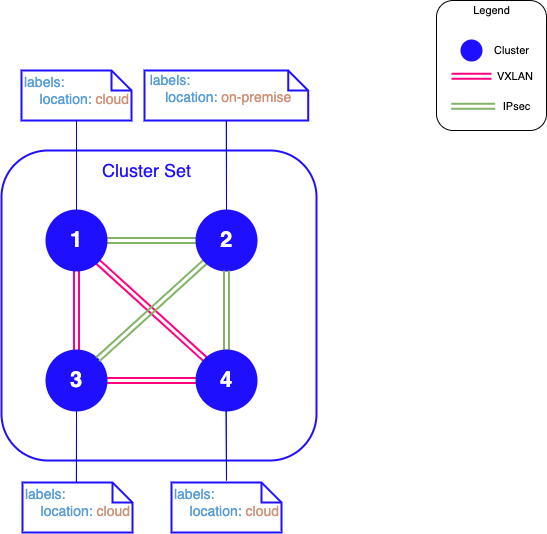

# Cable Driver Policy Support

## Summary

Submariner currently offers three cable drivers: VXLAN, IPSec or wireguard. However only one of these cable drivers
is enabled across all the clusters in a ClusterSet; That is all clusters that join a broker must use the same cable
driver. The goal of this proposal is to extend the current model to support the selection of different cable types
between connected clusters.

There are use cases that involve supporting a mix of cable drivers or cable driver configurations within the same
ClusterSet. For example, a ClusterSet could contain three clusters, two that are on-premise and the other
in a public cloud. Connections to the cloud cluster will need to use encryption while the on-premise clusters can use
unencrypted connections, as they’re connected by a private link, to avoid the performance overhead of encryption.

## Proposal

This enhancement proposes a new policy to allow users to selectively deploy different cable types between clusters
in a ClusterSet. The proposal assumes that connection between two clusters is symmetrical. If Cluster A is connected
to Cluster B via a VXLAN cable type - then Cluster B is connected to Cluster A via a VXLAN cable type and not another
cable type.

This enhancement will propose a single API for cable driver policy support using custom resource definition (CRDs).

### Cable driver policy API

This following CRD is proposed:

```Go
type ClusterConnectionPolicies struct {
    metav1.TypeMeta `json:",inline"`

    metav1.ObjectMeta `json:"metadata,omitempty"`

    ClusterConnectionPoliciesSpec `json:"spec"`
}

type ClusterConnectionPoliciesSpec struct {
 
    Policies []ClusterConnectionPolicy `json:"policies,omitempty"`
}

type ClusterConnectionPolicy struct {
    // LeftClusterSelector identifies the Cluster resources representing the clusters on one end of a connection. An empty
    // selector indicates wildcard, ie matches any cluster.
    LeftClusterSelector metav1.LabelSelector `json:"leftClusterSelector,omitempty"`

    // RightClusterSelector identifies the Cluster resources representing the clusters on the other end of a connection.
    // An empty selector indicates wildcard, ie matches any cluster.
    RightClusterSelector metav1.LabelSelector `json:"rightClusterSelector,omitempty"`

    // Name of the cable driver implementation to use for this connection.
    CableDriverName string `json:"CableDriverName"`

    // CableOptions specifies a additional configuration parameters for the cable driver.
    CableOptions map[string]string `json:"CableOptions,omitempty"`
}
```

The `ClusterConnectionPolicies` CR defines the criteria for selecting which cable driver to use to connect cluster pairs (or subsets)
and their associated (optional) configuration options. To resolve the connectivity policy for a remote cluster's Endpoint,
Submariner would:

- Search for a policy whose left and right label selectors match the corresponding Cluster resources of the local
  and remote Endpoints.

If any matching policy is found, the clusters are connected using the cable driver specified in the cable driver policy.

If no matching policy is found, the `default` cable driver policy is used. The `default` policy can be auto-created at broker
deploy time.

> **_NOTE:_** In the case of multiple labels being specified, the selector will need to match all the labels.
> Inequality-based requirements will be supported. For e.g. labels such as `env: !production` will match any clusters
> that aren't labelled with `env: production`.

The initial `CablePolicies` resources would be created (at startup time) and maintained on the broker cluster
and synced to each participating cluster.

### Labelling clusters

Clusters are defined as Custom Resources and can be labeled in the CRD. A new parameter to label clusters at
`subctl join` time could also be added for usability purposes.

#### Connection Policy Examples

- we want to specify a default policy that uses IPsec as the default cable driver.

```yaml
kind: ClusterConnectionPolicies
metadata:
  name: default
  namespace: submariner-operator
spec:
  cableDriver:
    name: "ipsec"
```

- We want to use specific cable drivers to connect clusters in a ClusterSet as shown in the image below. We
label the `Clusters` appropriately and define a number of policies with the appropriate label selectors.



```yaml
kind: CablePolicies
metadata:
  name: default
  namespace: submariner-operator
spec:
  cableDriver:
    name:  "vxlan"
```

```yaml
kind: CablePolicies
metadata:
  name: on-prem-to-cloud
  namespace: submariner-operator
spec:
  leftClusterSelector:
    env: production
  rightClusterSelector:
    env: production
  cableDriver:
    name:  "ipsec"
```

### Cable driver configuration

The cable driver configuration in Submariner only allows for the configuration of a single cable driver for a
gateway. This will pose a challenge when allowing for varying (or multiple) cable types between clusters based
on the defined cable driver policies. The goals of this part of the proposal is to extend the cable driver
configuration to:

- Maintain backward compatibility with the current cable driver configuration
- Create an extended cable driver configuration that allows for the setup of many drivers.

The proposed approach for additional Submariner cable driver configuration parameters is:

- To continue to use the existing environment variables injected into the Gateway Pod (with the exception of PSKs/secrets).
  These environment variables will come from the `Submariner.io_Submariners.yaml`.
- To extend `Submariner.io_Submariners.yaml` with some new global parameters for multiple cable driver configurations
  in a ClusterSet.

> **_NOTE:_** Modifications to cable driver configurations/policies may have implications on existing/active traffic flows
> as the cable drivers may need to be restarted.

The proposed global configuration parameter extensions to `Submariner.io_Submariners.yaml` to configure multiple cable drivers
are listed in the following table:

<!-- markdownlint-disable line-length -->
| Parameter name              | Description
|:----------------------------|:----------------------------------------------------------------------------|
| cableDrivers                | An array of strings listing the drivers to configure as separate cables.
<!-- markdownlint-enable line-length -->

> **_NOTE:_** the existing `cableDriver` parameter when used in combination with the new parameter can be interpreted as the
default/fallback driver.

The specification additions to `Submariner.io_Submariners.yaml` are shown below:

```yaml
cableDrivers:
  items:
    type: string
  type: array
```
